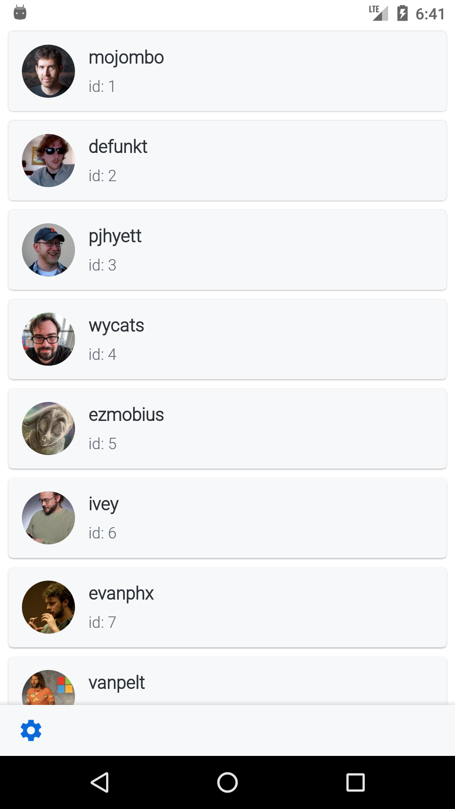
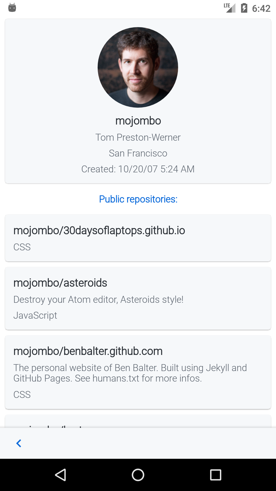
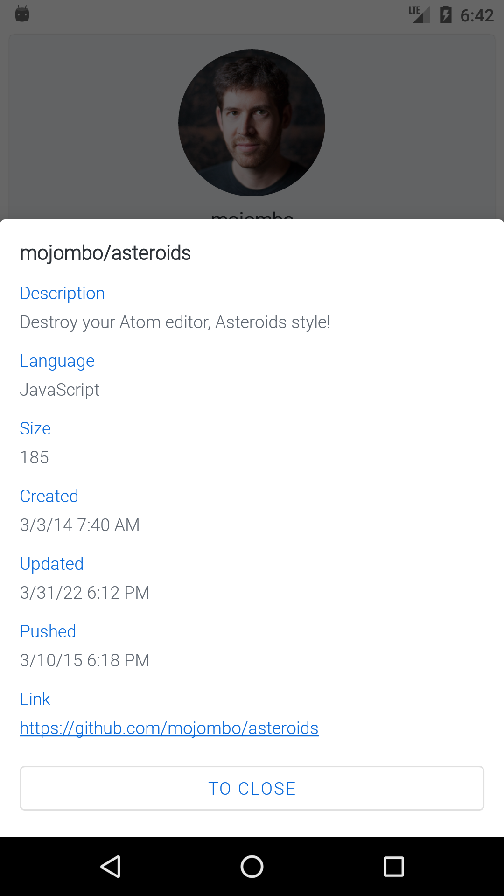

# GitHub

Приложение для просмотра списка пользователей GitHub.

[сервера]: https://hp-api.herokuapp.com/

## Скриншоты 

   
| Список пользователей                            | Профиль пользователя                            | Информация о репозитории                        |
| :---------------------------------------------: | :---------------------------------------------: | :---------------------------------------------: |   
|      |      |      | 
   

## Стек технологий

* Clean Architecture + MVVM
* Koin
* Retrofit2
* Glide
* ViewBinding
* JUnit-тесты

## Контакты

